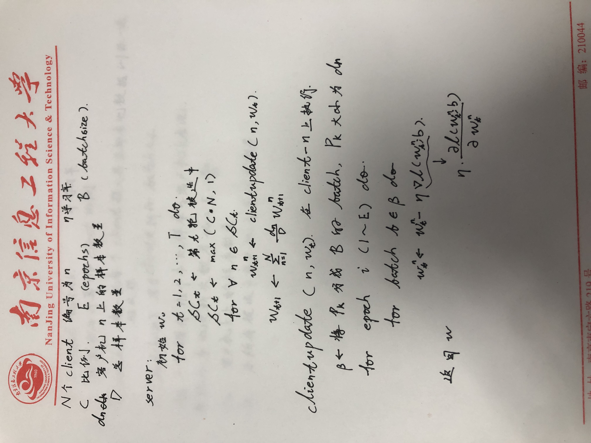
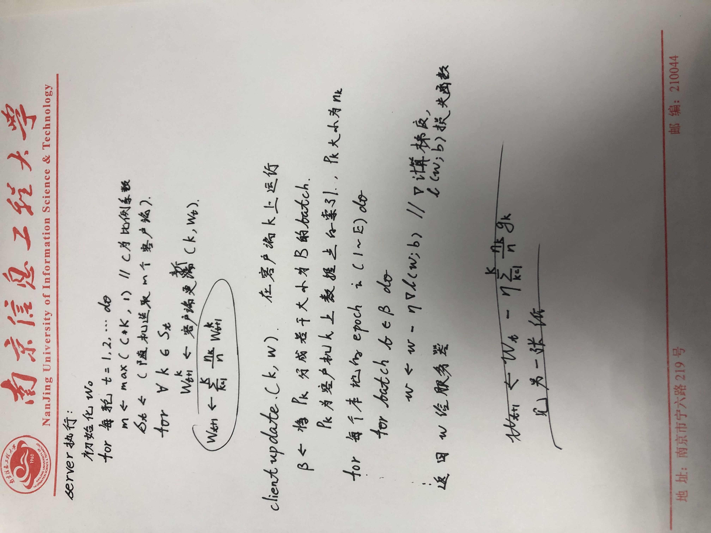

### 联邦架构

在本文中，我们将采用联邦平均算法作为分布式训练架构的基础。该算法是一种常用的联邦学习方法，旨在保证卫星雷达数据的隐私不泄露的情况下，实现各个分站点之间的模型合作训练。

在联邦平均算法中，中央服务器进行全局模型参数初始化，传输给所有参与训练的分站点即客户端，并按照固定的比例选取若干客户端进行训练。被选中的分站点将在本地使用全局模型参数对其拥有的数据集进行训练。在每一轮训练中，各个分站点将更新本地模型，并计算本地模型参数。然后，这些本地模型参数将通过安全的通信渠道传输到中央服务器。在中央服务器上，不会保存原始数据，而只是接收到来自各个分站点的本地模型参数。接下来，中央服务器将通过加权平均聚合方式，将局部模型参数聚合成全局模型参数。

在聚合过后，中央服务器会将更新后的全局模型参数发送回各个分站点。分站点将使用全局模型参数来更新本地模型参数，从而实现模型的全局合作训练。这个过程将在多轮迭代中不断重复，直到满足预定的迭代次数。

算法定义总共有N个client参与训练，C代表每一轮参与计算的client比例，C* N 则为每一轮参与计算的具体client数量。E代表每一轮每个client投入其全部本地数据参与训练的次数，B是用于client更新的batch大小，D代表全部client加起来的总样本数量。除此以外，设置学习率为α，dn代表编号为n的client的样本数量。

联邦平均算法的训练详细流程如算法1所示。
#### server算法
#### client算法

### 嵌入注意力机制的U型残差网络（Res-Unet-lham）

本文提出了嵌入注意力机制的U型残差网络，网络总体架构图如图所示。网络由残差结构的编码层，混合注意力机制层，跨层特征重建和解码层四大部分组成。

正如图中所示，该模型主要有左边的编码层，右边的解码层，混合注意力机制层三大功能层组成。从5个卫星通道的矩阵输入数据中提取有效特征是带有残差结构的编码层的主要功能（）。混合注意力机制层由轻量级的空间和通道注意力模块组成，主要用来提高编码器和解码器之间的相关性，使网络更加关注雷达反射率特征的提取并且为解码层图像尺寸恢复提供多尺度多层次的信息。解码层嵌入了跨层特征重建技术，主要功能是逐步恢复图像尺寸。

1. 残差结构的编码层
传统的unet编码层即特征提取层每层只有2层卷积+基本的BatchNorm操作，以及激活函数ReLU操作。虽然提出的时候大放异彩，但是应用于雷达反演操作的时候，浅层的网络无法提取有效特征，需要增加神经网络的深度来缓解此情况。但这个操作又引出新的问题，比如深层次的网络容易造成梯度爆炸等问题。针对深层次网络的此类问题，Resnet提出了残差结构，一定程度上避免了梯度爆炸等问题。实线、虚线的残差结构如图所示，

左边的是实线结构，右边的是虚线结构。虚线的残差结构具有降维的作用。

虽然相较于现有的层出不穷的新型网络，restnet网络架构表现不佳且在将凝聚过后的特征进行恢复，即恢复网络时进行特征融合时表现很差，但是resnet的残差结构依旧先进，活跃在各个新型网络的细节之处。本文将resnet的层级残差结构与U型网络设计理念相结合，以寻求更好的反演效果。

本网络在四个下采样层，每一层各自堆叠了一定数目的BasicBlock进行特征提取。具体来说，首先在每一层使用BasicBlock之前，使用MaxPool将图像的高度、宽度缩放为原来的1/2，再通过一系列的BasicBlock进行特征提取与通道维度扩张。
值得注意的是，在不同堆叠数目的BasicBlock之间使用虚线的残差结构进行降维，从而使捷径分支上的特征图像能与主分支上的特征图像shape相同，从而进行拼接。具体的特征提取每一层参数如表所示

2. 解码层
解码器在逐层上采样恢复图像尺寸的时候，需要填补很多空白信息，从无到有生成一些东西，这个过程需要一定量的辅助信息。但是随着网络层次的不断深入，特征图的通道维度越来越大，但是空间维度越来越小，包含的高分辨率细节信息也越来越少，因此，辅助信息也越来越匮乏。在传统的unet网络中，每层的二次卷积都造成了很大的高分辨率细节信息缺失。 本网络在编码层每层均采用多个BasicBlock进行特征学习，虽学习到了有效的特征信息，并且每层均采用残差结构尽可能保持高分辨率信息，但是在解码器进行上采样时依旧缺失一定的高分辨率辅助信息。

本网络采用共计五次上采样操作来多级恢复图像尺寸，重建图像细节。每个尺度的解码层均在跨层特征重建操作中将对应的编码层尺度嵌入混合注意力层并且进行1x1的卷积relu操作。

其中，为尽可能多的加入辅助信息，在编码器和解码器的结构基础上采用跨层特征重建操作，旨在将饱含高分辨率细节信息的编码器阶段的特征图与解码器上采样各个阶段结合，使得对应尺度上的特征信息引入到上采样过程中，为后期图像生成提供多尺度多层次的信息，从而更完善地重建图像的细节信息。

与unet所采用的skip connection不同，本网络不仅是简单的在解码器各个阶段生成不同尺度的特征副本，更针对每个特征副本嵌入混合注意力层，学习各个尺度下权重较大的特征信息送入解码层对应尺度进行图像重建。

本网络拟在特征图尺寸为14，28，56，112，224，448共计6个尺度进行跨层特征重建，从而弥补解码器上采样时候的高分辨率细节信息。

除了跨层特征重建，解码器还需要进行跨层拼接。具体来讲，除最后一层，其余各尺度解码层均需将跨层特征重建的特征图与下级上采样获得的特征图进行拼接操作，再进行1x1的卷积和relu操作。值得注意的是，前文编码器提及的卷积和relu操作，旨在提高跨通道信息交互，增加特征图的非线性特性。此处提及的操作，更旨在降维操作，便于下一次的上采样操作。比如第四层将（512，28，28）与跨层特征重建后的（256，28，28）进行拼接操作，尺寸为（768，28，28），再进行1x1的卷积和relu操作，降维到（512，28，28）便于上采样操作。

本网络提及的上采样操作均采用双线性插值方法，根据输入张量中相邻像素的加权平均值来计算给定位置处的输出值，相较于其他插值方法（如最近邻插值），双线性插值提供更平滑的结果，并且设置角像素的对齐方式为对齐，保留输入和输出之间的空间对应关系。

3. 混合注意力层
LHAM（Lightweight Hybrid Attention Module）
传统的unet网络使用的skip connection 可以有效地解决梯度消失问题，帮助网络更好地学习特征，加速收敛，并提高模型性能。但是Skip connection 的引入可能会导致网络中出现信息冗余的问题。某些特征可能在多个层级上出现，从而导致网络学习相同的特征多次，而忽略其他有用的信息。

主要由两个子模块组成。经过每个模块通过矩阵相乘使得输入矩阵学习相应模块权重。
means multiplication of matrix elements

受到SE注意力机制（Squeeze-and-Excitation Networks）在通道维度增加注意力机制的启发，本文针对输入的图像在每一层进行特征提取之前，额外增加一个分支嵌入轻量级的混合注意力层提高解码器和编码器之间的特征相关性，大幅减少上采样的时候造成的特征损失。
混合注意力层由通道注意力层和空间注意力层组成。整体架构图如图所示。

通道注意力层如图所示。
在输入注意力层之前，特征图的每个通道的权重值是等同的，但是经过通道注意力之后，不同通道的权重值也随之改变，使得网络更注意与结果相关的权值更大的通道。与SE类似，通道注意力层针对输入通道进行全局平均池化，此外为了减少每一层特征数据中冗余信息的干扰，将输入特征分出一个副本，加入全局最大池化。将分别经过平均、最大池化层的两个特征共同加入卷积层进行通道权值学习。最后将两层进行叠加、卷积、Sigmoid处理并将结果作为空间注意力层的输入。

这里用来通道权值学习的卷积模块层由两层卷积中间加一个relu层组合而成。第一层卷积将输入的维度压缩到1/16倍，再经过relu层，然后第二层卷积将其恢复到原本的输入维度。这里的16倍根据实际的通道数可以调整，本实验输入的通道分别为64，128，256，512，为减少参数量以及确保权值的学习，因此选择16作为整除倍率。

空间注意力层如图所示。
针对通道处理过后的特征图，生成一个副本，分别在空间维度进行平均和最大化处理。举例，将特征图从(512，64，64)变成（1，64，64），再将其进行拼接处理，生成（2，64，64）维度的特征图并送入（in_channel = 2,out_channel=1）的卷积层以及sigmoid层进行空间维度的权值学习。最后与原来的输入特征图进行相乘处理，为特征图的空间维度赋予相应权重。
### Loss函数设计
在实验中，数据集中存在显著的数据不平衡问题。 
雷达数据中大部分区域的雷达反射率较低，代表着该区域没有降水。考虑到强对流天气是低概率事件，较大的雷达反射率代表了强对流天气，在雷达数据中占有的比例很低。因此，反演模型必须着重关注雷达反射率较高的区域。然而使用常用的交叉熵损失函数会导致模型无法收敛，且损失函数对较大的雷达反射率一点都不敏感。

举例，选取2021年06月29日16点的雷达数据进行概率统计，统计结果如表所示。考虑到强对流天气在不同季节发生概率不同，根据前人经验，本文设定五个区间的权重分别为，其代表的实际意义具体见表。

于是，我们使用加权损失函数来解决样本不平衡问题，以提高模型反演较大雷达反射率的能力。
