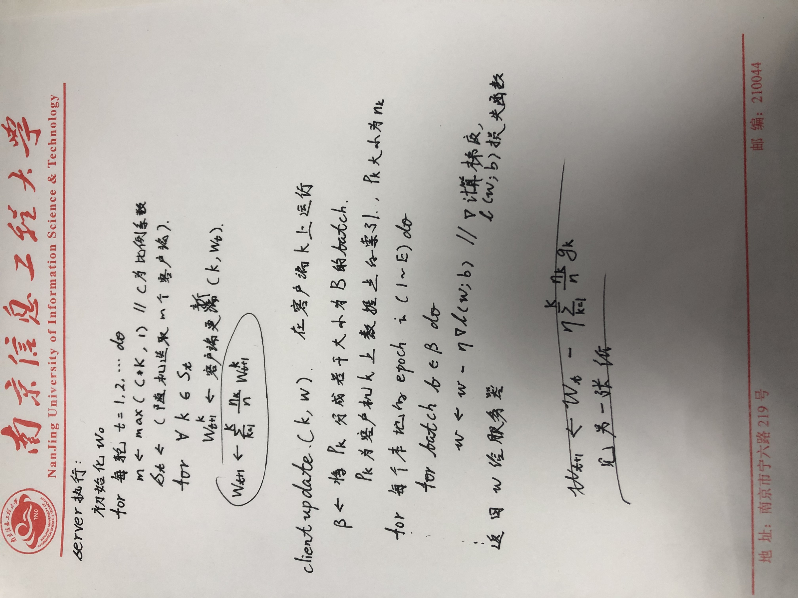

### 联邦架构

在本文中，我们将采用联邦平均算法作为分布式训练架构的基础，以应对静止轨道卫星数据海量且分散的特点。该算法是一种常用的联邦学习方法，旨在保证卫星雷达数据的隐私不泄露的情况下，实现各个分站点之间的模型合作训练。

在联邦平均算法中，中央服务器进行全局模型参数初始化，传输给所有参与训练的分站点即参与方，并按照固定的比例选取若干参与方进行训练，被选中的数据接收平台（分站点）将在本地使用全局模型参数对其拥有的数据集进行训练。在每一轮训练中，各个分站点将更新本地模型，并计算本地模型参数。然后，这些本地模型参数将通过安全的通信渠道传输到中央服务器。在中央服务器上，不会保存原始数据，而只是接收到来自各个分站点的本地模型参数。接下来，中央服务器将通过加权平均聚合方式，将局部模型参数聚合成全局模型参数。

接着，中央服务器将更新后的全局模型参数发送回各个分站点。分站点将使用全局模型参数来更新本地模型参数，从而实现模型的全局合作训练。这个过程将在多轮迭代中不断重复，直到达到收敛的效果或满足其他停止条件。

#### server算法
#### client算法

